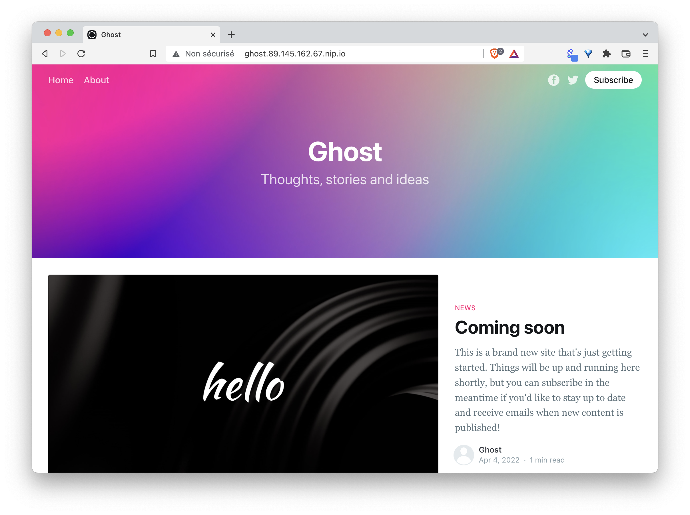

:warning: This exercise requires a specific configuration and cannot be performed outside of supervised training.

## Exercise

1. Install the NGinx ingress controller with Helm

```
helm repo add ingress-nginx https://kubernetes.github.io/ingress-nginx
helm install ingress ingress-nginx/ingress-nginx --version 4.9.1
```

2. What is the type of Service exposing the ingress controller ?

3. Add a Load Balancer to expose the Ingress Controller

Note: run the ```setup-lb.sh``` script located in the $HOME directory of your host machine

4. Create a pod named *ghost* based on the ghost:4 image and expose it with a ClusterIP service

Note: l'application ghost écoute sur le port 2368

5. Create an ingress resource that expose the above service on ghost.YOUR_HOST_IP.nip.io

Note: YOUR_HOST_IP is the IP of the machine on which you created the cluster's VMs

6. Verify you can access the ghost web interface from the outside

7. Delete the ingress resource, the pod and the service

## Documentation

[https://kubernetes.io/docs/concepts/services-networking/ingress/](https://kubernetes.io/docs/concepts/services-networking/ingress/)

<details>
  <summary markdown="span">Solution</summary>

1. Install the NGinx ingress controller with Helm

```
helm repo add ingress-nginx https://kubernetes.github.io/ingress-nginx
helm install ingress ingress-nginx/ingress-nginx --version 4.9.1
```

2. What is the type of Service exposing the ingress controller ?

The ingress controller is exposed with a LoadBalancer type service

```
k get svc ingress-ingress-nginx-controller
```

This service cannot get an external IP address as the cluster is not managed by a cloud provider.

3. Add a Load Balancer to expose the Ingress Controller

The following command runs a HAProxy container on the host machine:

```
./setup-lb.sh 
```

This container acts as a load balancer in front of your worker nodes and exposes the Ingress Controller via ${YOUR_HOST_IP}.nip.io

4. Create a pod named *ghost* based on the ghost:4 image and expose it with a ClusterIP service

```
k run ghost --image=ghost:4 --port 2368 --expose
```

5. Create an ingress resource that expose the above service on ghost.YOUR_HOST_IP.nip.io

In this example the public IP adress of the host machine is *89.145.162.32*

```
EXTERNAL_IP=89.145.162.32
cat <<EOF | k apply -f -
apiVersion: networking.k8s.io/v1
kind: Ingress
metadata:
  name: ingress
spec:
  ingressClassName: nginx
  rules:
  - host: ghost.$EXTERNAL_IP.nip.io
    http:
      paths:
      - path: /
        pathType: Prefix
        backend:
          service:
            name: ghost
            port:
              number: 2368
EOF
```

6. Verify you can access the ghost web interface from the outside

The ghost web interface can be accessed using the *ghost.YOUR_HOST_IP.nip.io* domain name (this one is resolved by nip.io)



7. Delete the ingress resource, the pod and the service

```
k delete ingress/ingress
k delete pod/ghost svc/ghost
```

</details>

