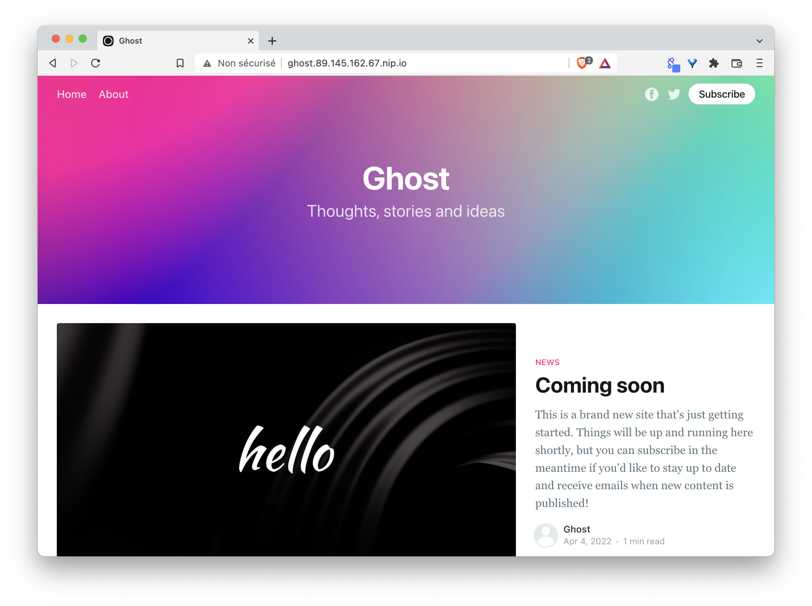

## Exercise

1. Install the NGinx ingress controller with Helm

2. How is the ingress controller exposed ? What is the external IP of the service ?

3. Which solution could you use to expose this ingress controller to the outside ?

4. Add a Load Balancer to expose the Ingress Controller

Note: run the ```setup-ingress-proxy.sh``` script located in the $HOME directory of your host machine

5. Create a pod named *ghost* based on the ghost:4 image and expose it with a ClusterIP service

6. Create an ingress resource that expose the above service on ghost.YOUR_HOST_IP.nip.io

7. Verify you can access the ghost web interface from the outside

8. Delete the ingress resource, the pod and the service

<details>
  <summary markdown="span">Solution</summary>

1. Install the NGinx ingress controller with Helm

```
helm upgrade --install ingress-nginx ingress-nginx \
  --repo https://kubernetes.github.io/ingress-nginx \
  --namespace ingress-nginx --create-namespace
```

2. How is the ingress controller exposed ? What is the external IP of the service ?

The ingress controller is exposed with a LoadBalancer type service

```
k -n ingress-nginx get svc
NAME                                 TYPE           CLUSTER-IP       EXTERNAL-IP   PORT(S)                      AGE
ingress-nginx-controller             LoadBalancer   10.96.133.38     <pending>     80:30933/TCP,443:30753/TCP   44s
ingress-nginx-controller-admission   ClusterIP      10.108.148.107   <none>        443/TCP                      44s
```

This service cannot get an external IP address as the cluster is not managed by a cloud provider.

3. Which solutions could you use to expose this ingress controller to the outside ?

[MetalLB](https://metallb.universe.tf/) is a common solution used to provide an IP address to LoadBalancer service created in bare metal clusters. We will not go into the details of MetalLB but it's definitely a project that is worth mentioning.

4. Add a Load Balancer to expose the Ingress Controller

The following command runs a HAProxy container on the host machine:

```
./setup-ingress-proxy.sh 
```

This container acts as a load balancer in front of your worker nodes and exposes the Ingress Controller via ${YOUR_HOST_IP}.nip.io

5. Create a pod named *ghost* based on the ghost:4 image and expose it with a ClusterIP service

```
k run ghost --image=ghost:4 --port 2368 --expose
```

6. Create an ingress resource that expose the above service on ghost.YOUR_HOST_IP.nip.io

In this exemple the public IP adress of the host machine is *89.145.162.67*

```
apiVersion: networking.k8s.io/v1
kind: Ingress
metadata:
  name: ingress
spec:
  ingressClassName: nginx
  rules:
  - host: ghost.89.145.162.67.nip.io
    http:
      paths:
      - path: /
        pathType: Prefix
        backend:
          service:
            name: ghost
            port:
              number: 2368
```

7. Verify you can access the ghost web interface from the outside

The ghost web interface can be accessed using the *ghost.YOUR_HOST_IP.nip.io* domain name (this one is resolved by nip.io)



8. Delete the ingress resource, the pod and the service

```
k delete ingress/ingress
k delete pod/ghost svc/ghost
```

</details>

